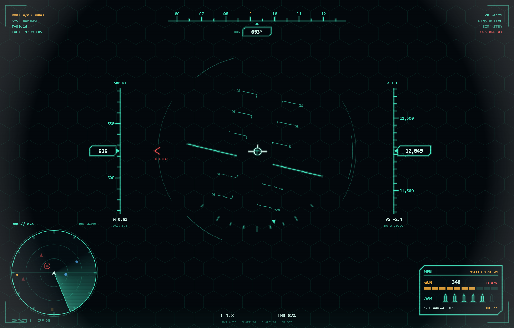

# FighterHud — WPF + SkiaSharp 戦闘機HUDデモ

ゲーム/アニメ風の戦術HUD(ヘッドアップディスプレイ)をリアルタイム描画するWPFアプリです。
すべての計器はサインカーブ合成の疑似フライトシミュレーション(`FlightSim`)で自動的に動きます。



## 実行方法

```powershell
dotnet run --project FighterHud.csproj
# または
dotnet build -c Release
.\bin\Release\net8.0-windows\FighterHud.exe
```

必要環境: .NET 8 Desktop Runtime / Windows

## 操作

| キー | 動作 |
|------|------|
| `F11` | フルスクリーン切替 |
| `Esc` | 終了 |

## 表示要素

- **方位テープ**(上): 5°刻み目盛・N/E/S/W表示・現在方位ボックス
- **速度テープ**(左): ノット表示、マッハ数、AOA(迎角)
- **高度テープ**(右): フィート表示、昇降率(VS)
- **ピッチラダー**(中央): ロール連動の人工水平線、負ピッチは破線
- **ロールスケール / フライトパスマーカー / ボアサイト**
- **レーダー**(左下): ヘディングアップ、回転スイープ+残光、敵=赤▲/友軍=青●/不明=橙■、Nマーカー
- **兵装パネル**(右下): 機関砲残弾(セグメントバー付き)、ミサイル残数アイコン、FOX 2表示
- **目標ロックボックス**: 回転ダイヤモンド、距離/接近率/高度のデータブロック、LOCK ON / SHOOT点滅
- **警報**: 周期的な MISSILE ALERT(画面枠点滅)
- **演出**: 六角グリッド背景、走査線、ビネット、リフレッシュバンド

## 構成

| ファイル | 内容 |
|----------|------|
| `FlightSim.cs` | 疑似フライトデータ(姿勢・速度・高度・残弾・コンタクト6機・ロック判定) |
| `HudRenderer.cs` | SkiaSharpによる全描画。要素ごとにメソッド分割 |
| `MainWindow.xaml(.cs)` | `SKElement` + `CompositionTarget.Rendering` による毎フレーム再描画 |

## カスタマイズの起点

- 配色: `HudRenderer` 先頭の `Main` / `Amber` / `Red` などの静的カラー
- 機体の動き: `FlightSim.Update()` のサイン波パラメータ
- 敵機・味方機: `FlightSim` コンストラクタの `Contact` リスト
- レイアウト: 各 `Draw*` メソッド冒頭の座標定数(`_s` はウィンドウサイズ連動の倍率)
