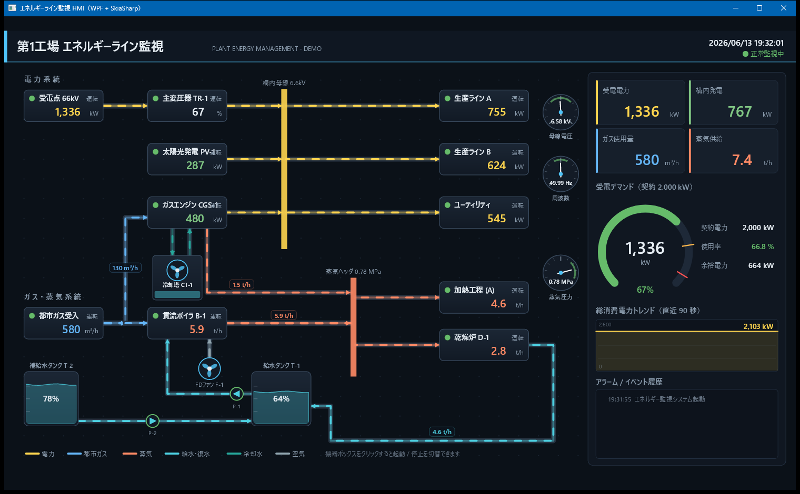
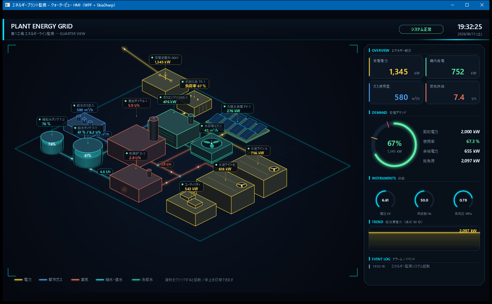
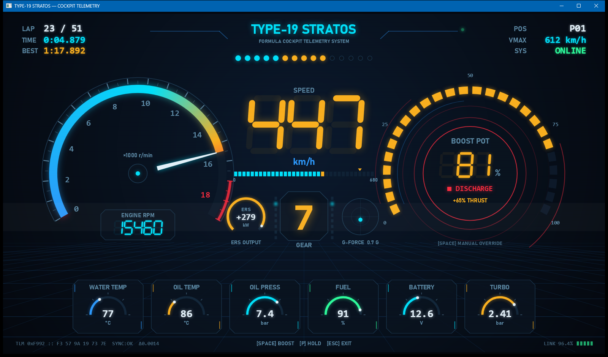
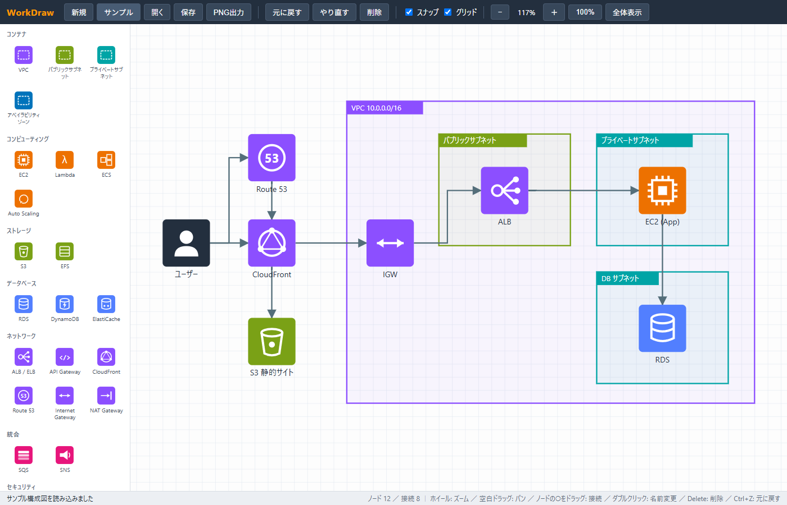

# WorkSkiaUI

[SkiaSharp](https://github.com/mono/SkiaSharp) を使った **WPF / Blazor の UI 描画サンプル集** です。
いずれもビルドしてそのまま実行できるスタンドアロンのサンプルで、計装 HMI・コックピット HUD・ダイアグラムエディタなど、コードベースの描画を題材にしています。

## サンプル一覧

| プロジェクト | 種別 | 概要 |
|---|---|---|
| [EnergyLineHmi](EnergyLineHmi/README.md) | WPF + SkiaSharp (.NET 8) | 工場エネルギーライン監視 HMI（俯瞰 P&ID ビュー） |
| [EnergyLineHmiIso](EnergyLineHmiIso/README.md) | WPF + SkiaSharp (.NET 8) | 同 HMI のクォータービュー（アイソメトリック）版 |
| [WorkCar](WorkCar/README.md) | WPF + SkiaSharp (.NET 10) | 近未来レーシングカーのコックピット HUD デモ |
| [WorkDraw](WorkDraw/README.md) | Blazor Server (.NET 10) | draw.io 風の AWS 構成図エディタ |

---

### [EnergyLineHmi](EnergyLineHmi/README.md)

電力 / 都市ガス / 蒸気 / 復水・給水 の各系統を 1 枚のフロー図で監視する WPF + SkiaSharp 製の HMI。
配管を流れるアニメーション、機器の起動 / 停止操作、デマンドゲージ、トレンド、アラーム履歴を備えます。

[](EnergyLineHmi/README.md)

### [EnergyLineHmiIso](EnergyLineHmiIso/README.md)

EnergyLineHmi と同じプラントを 2:1 アイソメトリックで立体表示する近未来風グリッドビュー。
エネルギーの流れを、配管上を移動する光のパルスとして表現します。

[](EnergyLineHmiIso/README.md)

### [WorkCar](WorkCar/README.md)

フォーミュラ風のコックピット HUD「TYPE-19 STRATOS」。車両シミュレータが走行シーンを自動再生し、
タコメータ・スピード・ブーストポット・各種ゲージがリアルタイムに動きます（`Space` でブースト）。

[](WorkCar/README.md)

### [WorkDraw](WorkDraw/README.md)

Blazor Server 製の draw.io 風ダイアグラムエディタ。AWS 構成図に特化したステンシルを備え、
ドラッグ＆ドロップ配置・直交ルーティング接続・ズーム / パン・Undo/Redo・JSON 保存・PNG 出力に対応します。

[](WorkDraw/README.md)

---

## ビルド / 実行

各プロジェクトのフォルダで以下を実行します。

```powershell
dotnet run -c Release
```

- **EnergyLineHmi / EnergyLineHmiIso / WorkCar**: Windows 上で WPF ウィンドウが開きます（要 .NET SDK）。
- **WorkDraw**: 起動後にコンソール表示の URL（例: `http://localhost:5233`）をブラウザで開きます。

> .NET 10 SDK があれば .NET 8 ターゲットを含む全プロジェクトをビルドできます。
