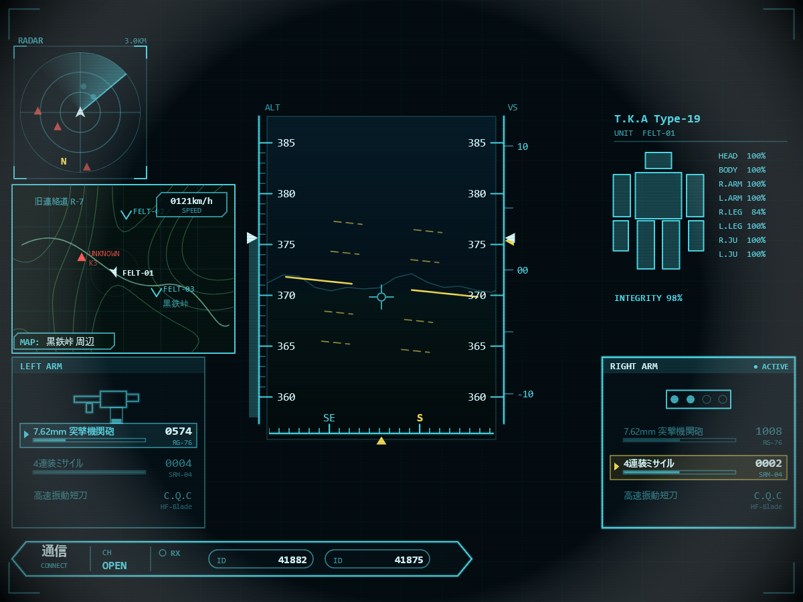

# TacticalArmorHud — WPF + SkiaSharp 戦術機コックピットHUD

参考画像(戦術機/TSF風ゲーム画面)を基に再現した、人型機動兵器のコックピットHUDです。
シアン/ティール基調のフォスファー調で、疑似シミュレーション(`ArmorSim`)が全表示を自動駆動します。
`FighterHud` / `MechHud` とは独立した別プロジェクトです(既存ソースには変更を加えていません)。



## 実行方法

```powershell
dotnet run --project TacticalArmorHud.csproj
# または
dotnet build -c Release
.\bin\Release\net8.0-windows\TacticalArmorHud.exe
```

必要環境: .NET 8 Desktop Runtime / Windows / 日本語フォント(Yu Gothic UI)

## 操作

| キー | 動作 |
|------|------|
| `F11` | フルスクリーン切替 |
| `Esc` | 終了 |

## 画面要素

参考画像を土台に、独自設定(部隊 FELT / 機体 TKA Type-19 / 地名 黒鉄峠)へアレンジしています。

- **レーダー**(左上): **真上視点**の同心円スコープ。回転スイープ・敵性ブリップ(赤▲)・友軍(シアン●)・
  自機シェブロン・ヘディングアップのN表示
- **戦術マップ**(左・上寄り): 等高線地形・道(旧連絡道 R-7)・地名(黒鉄峠)・速度ボックス・
  自軍部隊 **FELT-01(自機)/ FELT-02 / FELT-03**・敵性 `UNKNOWN K3`・自機の方位矢印+ピング・`MAP: 黒鉄峠 周辺`
- **高度テープ×2**(中央左右): 360〜385スケール。左は現在値バー+キャレット、
  右は同スケール+ `10/00/-10` の昇降微指示
- **中央ビュー**: 外景(空/地表/稜線)+ 黄色ピッチラダー + ボアサイト(敵機表示なし)
- **方位ストリップ**(下中央): N/NE/E/SE/S… のヘディングテープ + 中央ポインタ
- **機体ダメージ表示**(右上): `T.K.A Type-19` / `UNIT FELT-01`。頭部・ボディ・左右腕・左右脚・
  左右跳躍ユニット(手の下/足の横、脚より短い)の**計8部位を個別の矩形**で描画し、各部位HP%を色分け(緑→琥珀→赤)。
  被弾時はフラッシュ+ `INTEGRITY` 総合値
- **兵装表示**: **LEFT ARM(画面左)/ RIGHT ARM(画面右)** の2スロットを**同じ高さ**で表示
  - 各アームが **7.62mm突撃機関砲(RG-76)/ 4連装ミサイル(SRM-04)/ 高速振動短刀(HF-Blade)** の3兵装から個別に選択(自動巡回・残弾も腕ごとに独立)
  - 装備中の武装はアイコン(静的・**画像内に残弾**=弾倉ゲージ/4連装の発射管)+ハイライト行。**非選択の武装は淡色のリスト行**で併記
  - 使用中(発砲中)のアームをハイライト。ミサイル斉射時は画面**中央下部**に **FOX-2** を点滅表示
- **通信パネル**(最下部): **六角リボン形状**。`通信 / CONNECT`、`CH OPEN`、TX/RX + 発信元、
  丸型カプセルの回線ID(`ID 41882` / `ID 41875`)
- **演出**: 走査線、ビネット、被弾枠フラッシュ、周期警告

## 自動挙動

兵装は約8.5秒ごとに切替(36mm=連射でゲージ減、120mm=単発で残弾6、刃力=抜刀モーション)。
切替時は対象弾種が枯渇するとリロード後に補充。最寄りの敵を自動ロックし、近距離で `FIRE` 点滅。

## 構成

| ファイル | 内容 |
|----------|------|
| `ArmorSim.cs` | 姿勢・高度・速度・兵装/残弾・通信・コンタクト・マップマーカーの疑似シム |
| `ArmorRenderer.cs` | SkiaSharpによる全描画。キャンバスを4:3レターボックス補正し、800×600基準座標で描画 |
| `MainWindow.xaml(.cs)` | `SKElement` + `CompositionTarget.Rendering` 描画ループ |

## カスタマイズの起点

- 配色: `ArmorRenderer` 先頭の静的カラー(`Cyan` / `Yellow` / `Red` ほか)
- 兵装(名称・型番・残弾): `ArmorSim` の `Weapons` 配列
- 機体名・部隊名: `ArmorRenderer.DrawDamagePanel()`(TKA Type-19 / FELT-01)
- ダメージ部位・耐久: `ArmorSim.PartTags` / `PartHp` と `DrawDamagePanel()` の矩形配置
- マップ部隊・地名: `ArmorSim` の `Markers` と `ArmorRenderer.DrawMap()` 内のラベル
- 地形: `ArmorRenderer.BuildMapContour()` のサイン波合成と `levels`
- レイアウト: 各 `Draw*` の参考座標(800×600基準。`X,Y` をそのまま画像から拾える)
