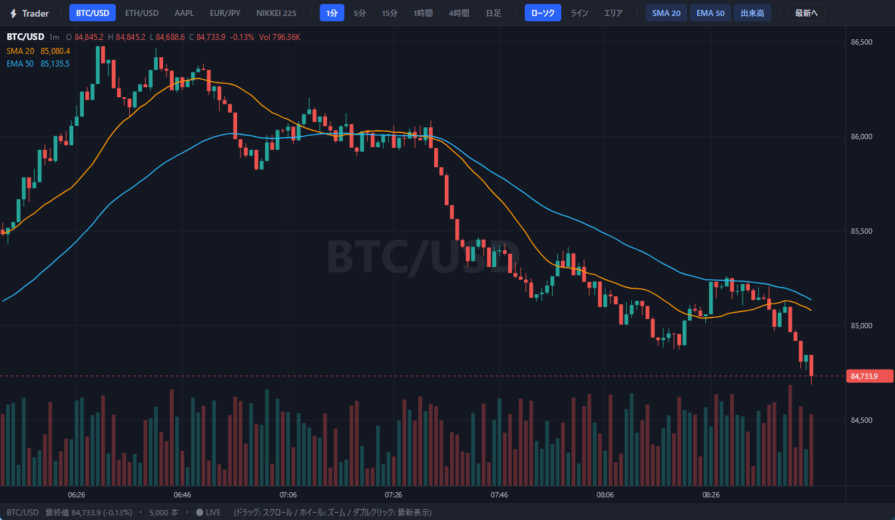

# Trader — TradingView風チャート (WPF + SkiaSharp)

[wieslawsoltes/WebScene](https://github.com/wieslawsoltes/WebScene) の
「TradingViewターミナル」サンプルにインスパイアされた、WPF + SkiaSharp 製の
ネイティブなトレーディングチャートアプリです。Webランタイムを介さず、
すべて SkiaSharp のキャンバス描画で実装しています。



## 機能

- **ローソク足 / ライン / エリア** の3種類のチャートタイプ
- **リアルタイム更新** — 100ms ごとのティックシミュレーションで最終足が更新され、
  時間足の境界で新しい足が生成される
- **パン / ズーム** — ドラッグでスクロール、マウスホイールでカーソル位置基準のズーム。
  右端までスクロールすると最新足への自動追従モードに復帰
- **クロスヘア** — 足にスナップする縦線＋自由な横線、価格軸/時間軸にチップ表示
- **オートスケール** — 表示範囲の高値・安値（＋表示中のインジケーター）に自動フィット
- **インジケーター** — SMA 20 / EMA 50 / 出来高バー（個別ON/OFF）
- **現在値ライン** — 破線＋価格軸チップ（画面外のときは軸内にクランプ）
- **OHLC凡例** — 左上にホバー中（または最新）の足の O/H/L/C・変化率・出来高
- **5銘柄 × 6時間足** — BTC/USD, ETH/USD, AAPL, EUR/JPY, NIKKEI 225 ×
  1分/5分/15分/1時間/4時間/日足（銘柄・時間足ごとに独立した系列をキャッシュ）
- TradingView ダークテーマ準拠の配色

## 操作方法

| 操作 | 動作 |
|---|---|
| ドラッグ | チャートをスクロール |
| マウスホイール | カーソル位置を基準にズーム |
| ダブルクリック / 「最新へ」ボタン | 直近160本を表示して右端追従に復帰 |
| マウスホバー | クロスヘア表示、凡例がホバー中の足の値に切替 |

## ビルドと実行

.NET 10 SDK（`net10.0-windows` / WPF）が必要です。

```bash
dotnet run --project Trader
```

## プロジェクト構成

```
Trader/
├── Models/Candle.cs           # OHLCV 構造体
├── Data/MarketData.cs         # 銘柄定義・疑似マーケットデータ生成(GBM+トレンドレジーム)・ティック更新
├── Charting/
│   ├── ChartControl.cs        # SKElement 派生のチャート本体(描画+入力処理)
│   ├── Indicators.cs          # SMA / EMA
│   └── Theme.cs               # TradingView ダークテーマ配色
├── MainWindow.xaml(.cs)       # ツールバー・ステータスバー・チャートのホスト
└── App.xaml(.cs)              # ダークテーマの WPF スタイル定義
```

## 実装メモ

- **描画**: `SKElement`(CPUラスタライズ)の `OnPaintSurface` で毎フレーム全体を再描画。
  DPIスケールは `canvas.Scale()` で吸収し、以降はWPFのDIP座標系で描画するため
  マウス座標とそのまま一致する。SkiaSharp 3.x のため文字描画は `SKFont` ベース。
- **ビューポート**: X軸は「ローソク足インデックス」空間で管理
  (`_firstIndex` + `_visible` 本)。ズームはカーソル位置のインデックスを不動点として
  `_visible` を変える。Y軸は表示範囲からのオートスケール。
- **データ**: 幾何ブラウン運動＋数十本単位で向きが変わるドリフト(トレンドレジーム)で
  1系列5,000本を生成。`Tick()` が最終足の C/H/L/V を更新し、時間足境界で足を追加する。
- 実データに差し替える場合は `MarketSeries` を WebSocket 等からの
  `List<Candle>` 更新＋`Version` インクリメントに置き換えるだけでよい。
